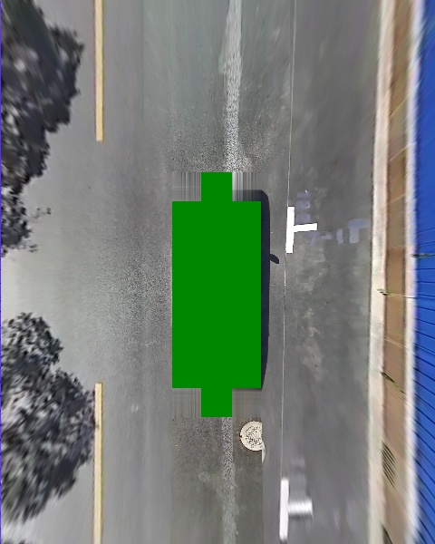

# Img Style Transfer for Data Augmentation

This project aims to test the data augmentation, especially the color transfer for the img of car driving in different weather situation.  Reference papers and code were listed below:
1. Forked from https://github.com/enomotokenji/pytorch-Neural-Style-Transfer

2.	Mikolajczyk A , Grochowski M . Data augmentation for improving deep learning in image classification problem[C]// International Interdisciplinary Phd Workshop. IEEE, 2018:117-122.

3.	Gatys L A , Ecker A S , Bethge M . Image Style Transfer Using Convolutional Neural Networks[C]// Computer Vision & Pattern Recognition. IEEE, 2016.

## Test
content: morning_cloud

style: noon_sun / night

  

### Transfer the color style of noon_sun to morning_cloud 
morning_cloud + part of noon_sun with 500 epochs and content_weight:style_weight = 1:400

  

### Transfer the color style of night to morning_cloud
morning_cloud + part of night with 500 epochs and content_weight:style_weight = 1: 150

  

morning_cloud + another part of night with 500 epochs and content_weight:style_weight = 1: 150

  

### Use the full img
suggest that use the part of img which you want the network to learn, but not the full img. And the bad result which used the full noon_sun img was listed below.


## How to use
### Style transfer for color augmentation 
in style_transfer.py, change some argms:
```python
epoch = 500
content_weight = 1
style_weight = 150  # 40
initialize_noise = False
cuda = True
```
### Cut the img
use the cut_img.py
